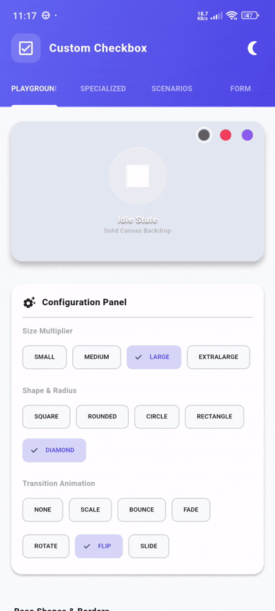

# flutter_custom_checbox_library

[](https://flutter.dev)
[](https://opensource.org/licenses/MIT)
[](#)

**flutter_custom_checbox_library** is a premium, highly customizable, and interactive checkbox toolkit for Flutter. It features visual styles (circle, rounded, square, outlines, fills), customized specialized checkboxes (gradient, glassmorphism, neumorphic, icon, emoji), flow/list selections, and standard form validator field integration.

---

## 📷 Preview

<p align="center">
  
</p>

*A premium custom checkbox toolkit featuring animated custom shapes, smooth scaling/bouncing transitions, gradient fills, glassmorphism overlays, soft neumorphic buttons, and form validations.*

---

## ✨ Features

- **📊 Visual Shapes & Styles**
  - Select between distinct shapes: Circle, Rounded, Square, Rectangle, and Diamond.
  - Supports outlined border-only designs or fully filled color blocks.
- **🚀 Interactive Micro-Animations**
  - Custom transition effects: Scale, Bounce, Rotate, Fade, Flip, and Slide.
- **🎨 Specialized Graphic Overlays**
  - **GlassCheckbox**: Frosted glass container with customizable backdrop blur and background opacity.
  - **GradientCheckbox**: Fills checkbox with linear, radial, or sweep color gradients.
  - **IconCheckbox & EmojiCheckbox**: Displays custom icons or emojis in place of standard checkmarks.
  - **NeumorphismCheckbox**: Inner/outer soft shadow curves for neumorphic designs.
  - **ImageCheckbox**: Displays any custom widget when checked.
- **📝 Collection & Layout Widgets**
  - **CheckboxTile**: Compact list tile supporting custom leading/trailing checkbox layout configurations.
  - **CheckboxGroup**: Groups checkboxes into vertical or wrap lists supporting single-selection (radio logic) and multi-selection (with Select All toggling).
  - **CheckboxGrid**: Lays checkboxes out in a responsive scrollable grid pattern.
  - **CheckboxWrap**: Custom flow layout wrapping elements dynamically.
- **🔒 Standalone & Form Modes**
  - Works standalone dynamically.
  - Features a custom `CheckboxFormField` for standard validation inside standard `Form` structures.

---

## 📦 Installation

To use this library in your Flutter project, add it to your `pubspec.yaml` dependencies:

```yaml
dependencies:
  flutter:
    sdk: flutter
  # From local workspace or pub.dev
  flutter_custom_checbox_library: ^0.0.1
```

Or reference it directly from a Git repository:

```yaml
dependencies:
  flutter_custom_checbox_library:
    git:
      url: https://github.com/your_username/flutter_custom_checbox.git
      ref: main
```

---

## 🚀 Usage

Import the package in your Dart code:

```dart
import 'package:flutter_custom_checbox_library/flutter_custom_checbox_library.dart';
```

### 1. Animated Checkbox (Bounce Animation)
```dart
AnimatedCheckbox(
  value: _isChecked,
  animation: CheckboxAnimation.bounce,
  size: CheckboxSize.medium,
  shape: CheckboxShape.rounded,
  onChanged: (val) {
    setState(() {
      _isChecked = val;
    });
  },
)
```

### 2. Specialized Checkbox (Glassmorphism & Gradients)
```dart
// Gradient Checkbox
GradientCheckbox(
  value: _isChecked,
  gradient: const LinearGradient(
    colors: [Colors.orange, Colors.pink],
  ),
  onChanged: (val) {},
)

// Glassmorphism Checkbox
GlassCheckbox(
  value: _isChecked,
  blur: 8,
  opacity: 0.25,
  onChanged: (val) {},
)
```

### 3. CheckboxGroup (Multi-Selection with Select All)
```dart
CheckboxGroup<String>(
  items: const [
    CheckboxItem(title: 'Flutter', data: 'flutter', value: true),
    CheckboxItem(title: 'SwiftUI', data: 'swiftui', value: false),
    CheckboxItem(title: 'Jetpack Compose', data: 'compose', value: false),
  ],
  showSelectAll: true,
  multiSelection: true,
  onChanged: (selectedItems) {
    print('Selected: ${selectedItems.map((e) => e.data)}');
  },
)
```

### 4. Enable Standard Form Validation
```dart
Form(
  key: _formKey,
  child: Column(
    children: [
      CheckboxFormField(
        title: 'Agree to terms',
        subtitle: 'Read and accept terms of service.',
        initialValue: _isAgreed,
        autovalidateMode: AutovalidateMode.onUserInteraction,
        onChanged: (val) => setState(() => _isAgreed = val),
        validator: (val) => val != true ? 'Required field' : null,
      ),
      ElevatedButton(
        onPressed: () {
          if (_formKey.currentState!.validate()) {
            // Form validation success!
          }
        },
        child: const Text('Submit'),
      ),
    ],
  ),
)
```

---

## 🛠️ API Reference

### `CustomCheckbox` Properties:

| Property | Type | Default | Description |
| :--- | :--- | :--- | :--- |
| `value` | `bool` | *Required* | Whether the checkbox is checked. |
| `onChanged` | `ValueChanged<bool>?` | *Required* | Callback invoked when the state toggles. |
| `controller` | `CheckboxController?` | `null` | Controller for managing state programmatically. |
| `shape` | `CheckboxShape` | `CheckboxShape.square` | Boundary shapes (`square`, `rounded`, `circle`, `rectangle`, `diamond`). |
| `size` | `CheckboxSize` | `CheckboxSize.medium` | Checkbox dimensions (`small`, `medium`, `large`, `extraLarge`). |
| `animation` | `CheckboxAnimation` | `CheckboxAnimation.scale` | Animations (`none`, `scale`, `bounce`, `fade`, `rotate`, `flip`, `slide`). |
| `enabled` | `bool` | `true` | Whether interactivity is active. |
| `theme` | `CustomCheckboxThemeData` | `CustomCheckboxThemeData()` | Custom colors, border, check sizes and elevation configurations. |

---

## 📄 License

```lic
MIT License

Copyright (c) 2026 Excelsior Technologies

Permission is hereby granted, free of charge, to any person obtaining a copy
of this software and associated documentation files (the "Software"), to deal
in the Software without restriction, including without limitation the rights
to use, copy, modify, merge, publish, distribute, sublicense, and/or sell
copies of the Software, and to permit persons to whom the Software is
furnished to do so, subject to the following conditions:

The above copyright notice and this permission notice shall be included in all
copies or substantial portions of the Software.

THE SOFTWARE IS PROVIDED "AS IS", WITHOUT WARRANTY OF ANY KIND, EXPRESS OR
IMPLIED, INCLUDING BUT NOT LIMITED TO THE WARRANTIES OF MERCHANTABILITY,
FITNESS FOR A PARTICULAR PURPOSE AND NONINFRINGEMENT. IN NO EVENT SHALL THE
AUTHORS OR COPYRIGHT HOLDERS BE LIABLE FOR ANY CLAIM, DAMAGES OR OTHER
LIABILITY, WHETHER IN AN ACTION OF CONTRACT, TORT OR OTHERWISE, ARISING FROM,
OUT OF OR IN CONNECTION WITH THE SOFTWARE OR THE USE OR OTHER DEALINGS IN THE
SOFTWARE.
```
